# Sharingan 👁️

**Live HTTP · MQTT · Bluetooth logging for Kotlin Multiplatform — iOS & Android, one API.**

Sharingan is an on-device debug logger. It captures protocol traffic while you use your app, surfaces it in a sticky capture notification (Android) and a built-in log browser (both platforms), and is optimized for **extracting clean, structured logs to hand to a human — or an AI agent** — to pin down bugs across backend, app and firmware.

> The name is a Naruto reference: the eye that sees everything.

**Android**

<table>
  <tr>
    <td align="center">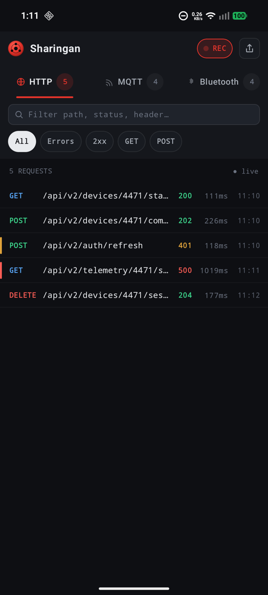</td>
    <td align="center">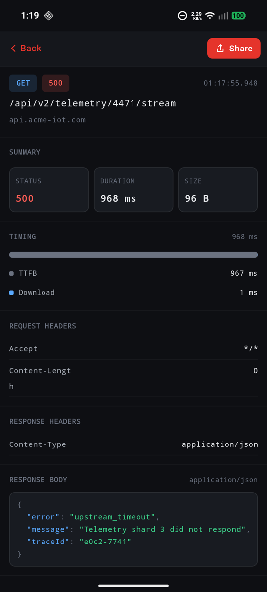</td>
    <td align="center">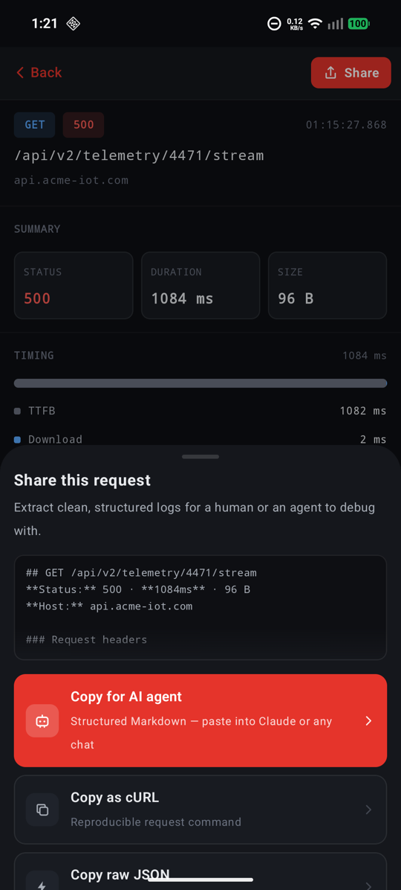</td>
  </tr>
  <tr>
    <td align="center"><sub>HTTP tab — live list with failure rails</sub></td>
    <td align="center"><sub>Event detail — timing, headers, JSON</sub></td>
    <td align="center"><sub>Share sheet — "Copy for AI agent" first</sub></td>
  </tr>
  <tr>
    <td align="center">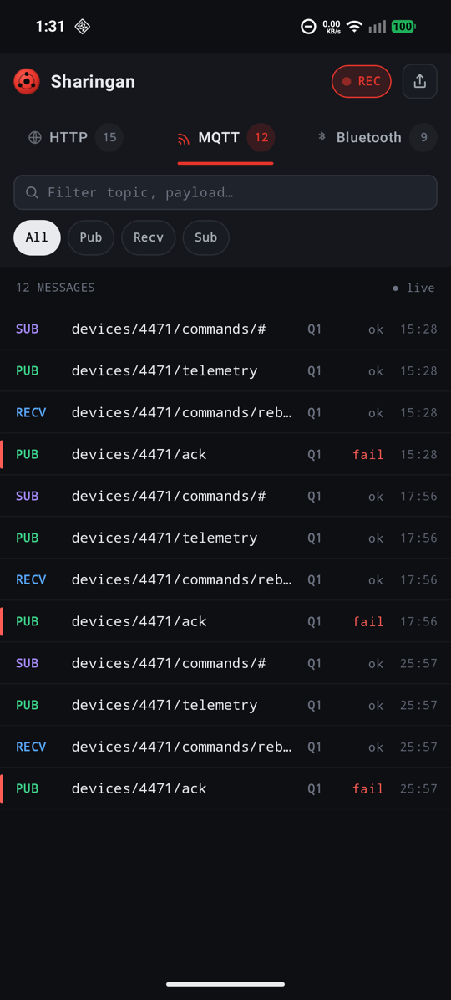</td>
    <td align="center">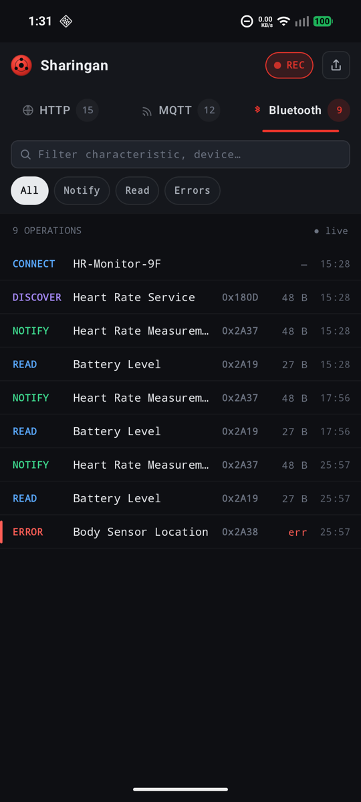</td>
    <td align="center">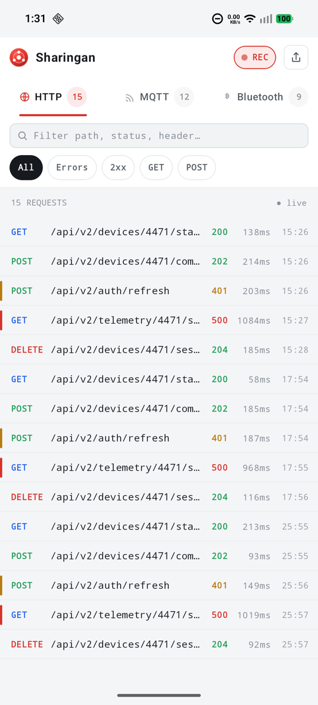</td>
  </tr>
  <tr>
    <td align="center"><sub>MQTT tab — pub/recv/sub with QoS</sub></td>
    <td align="center"><sub>Bluetooth tab — GATT operations</sub></td>
    <td align="center"><sub>Light mode follows the system theme</sub></td>
  </tr>
</table>

**iOS** — the same browser, presented from Swift via `SharinganViewControllerKt.presentSharingan(animated:)`:

<table>
  <tr>
    <td align="center">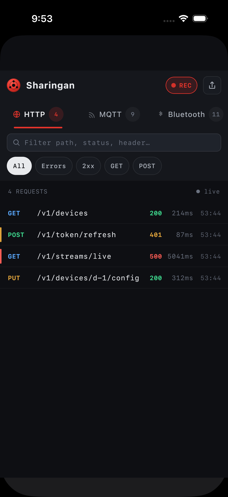</td>
    <td align="center">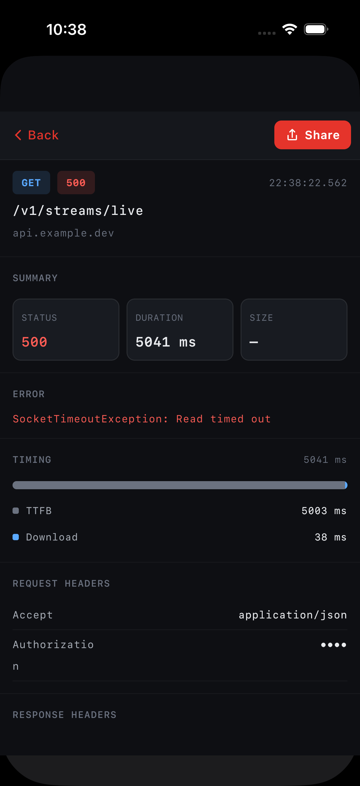</td>
    <td align="center">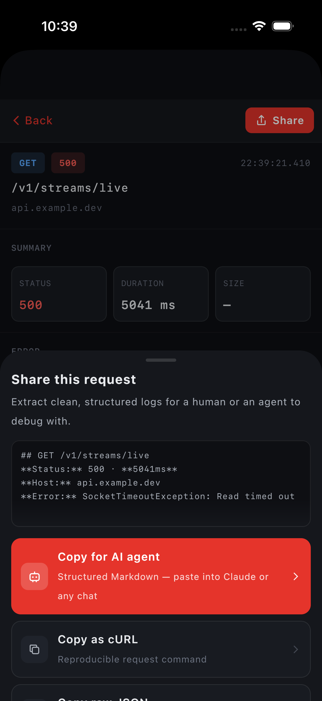</td>
  </tr>
  <tr>
    <td align="center"><sub>HTTP tab — live list with failure rails</sub></td>
    <td align="center"><sub>Event detail — timing, headers, JSON</sub></td>
    <td align="center"><sub>Share sheet — "Copy for AI agent" first</sub></td>
  </tr>
  <tr>
    <td align="center">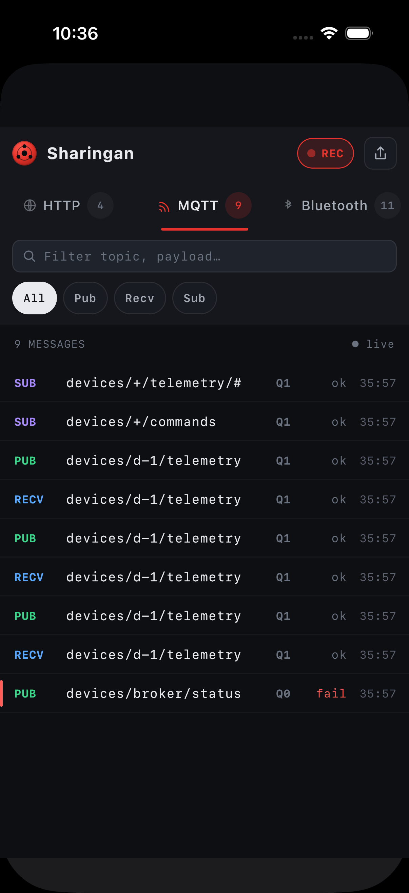</td>
    <td align="center">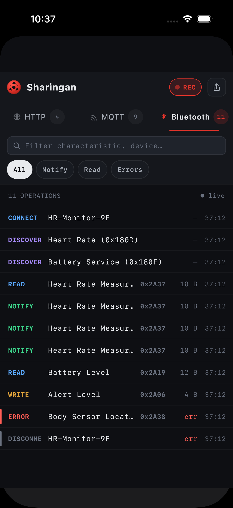</td>
    <td align="center">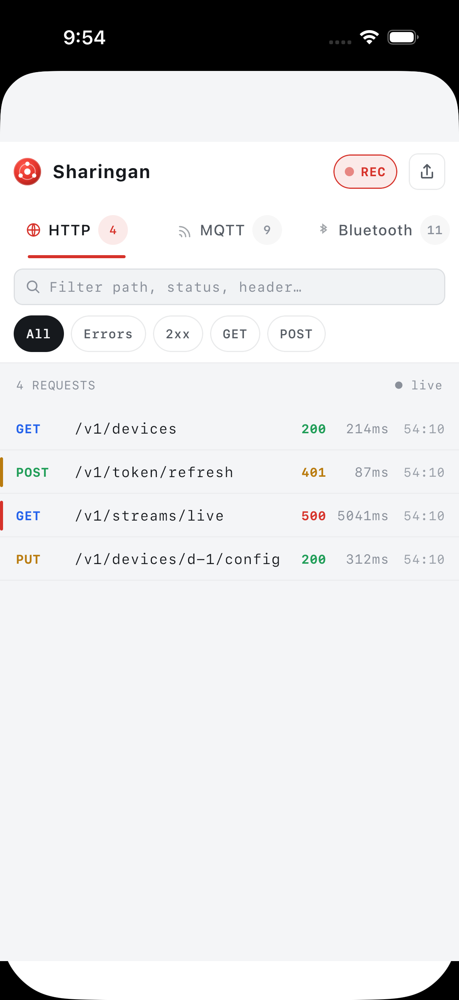</td>
  </tr>
  <tr>
    <td align="center"><sub>MQTT tab — pub/recv/sub with QoS</sub></td>
    <td align="center"><sub>Bluetooth tab — GATT operations</sub></td>
    <td align="center"><sub>Light mode follows the system theme</sub></td>
  </tr>
</table>

## Features

- **Three protocol tabs** — HTTP, MQTT, Bluetooth (BLE/GATT), each with live counts, search and quick filters, in a compact terminal-density list.
- **Detail view per event** — timing waterfall, request/response headers (secrets redacted at capture), syntax-colored JSON bodies, QoS/retain flags, GATT operations and decoded values.
- **Share sheet built for agents** — "Copy for AI agent" produces structured Markdown an LLM parses reliably; cURL, raw JSON and the system share sheet are one tap away.
- **Zero release impact** — swap in the `sharingan-noop` artifact: identical API, captures nothing, ships no UI.
- **Memory-only** — an in-memory ring buffer (default 300 events); nothing is ever written to disk.
- **Minimal** — no image assets, no icon fonts, no bundled typefaces, no DI, no navigation library. The capture core depends only on coroutines (+ Ktor when you use the plugin).

Requirements: Android API 24+, iOS arm64 + simulator arm64, Ktor 3.x for the HTTP plugin.

## Setup

### Get the artifacts

Sharingan is on [Maven Central](https://central.sonatype.com/artifact/io.github.mibrahimdev/sharingan).
Add `mavenCentral()` to your repositories (`settings.gradle.kts` →
`dependencyResolutionManagement { repositories { mavenCentral(); ... } }`),
then depend on the coordinate for your build type:

| Coordinate | Use |
|---|---|
| `io.github.mibrahimdev:sharingan:0.1.0` | debug builds (capture + UI) |
| `io.github.mibrahimdev:sharingan-noop:0.1.0` | release builds (same API, inert, no UI) |

**Tested versions:** Sharingan 0.1.0 → Kotlin **2.4.0**, Ktor **3.5.0**,
Compose Multiplatform **1.11.1**, AGP 8.13.2. Later versions may work but are
unverified — Kotlin/Native has no cross-compiler-version binary
compatibility guarantee, so match the Kotlin version exactly.

#### Building from source / contributing

To build against local changes, publish to your Maven local repo and add
`mavenLocal()` to your repositories (`settings.gradle.kts` →
`dependencyResolutionManagement { repositories { mavenLocal(); ... } }`):

```bash
git clone https://github.com/mibrahimdev/Sharingan && cd Sharingan
./gradlew publishToMavenLocal
```

### Android app (two lines)

```kotlin
dependencies {
    debugImplementation("io.github.mibrahimdev:sharingan:0.1.0")
    releaseImplementation("io.github.mibrahimdev:sharingan-noop:0.1.0")
}
```

That's the whole integration story for build types: debug builds get capture + UI, release builds get the inert no-op (see [what "no effect" means](#release-builds-what-no-effect-means)). On Android there is **zero init code** — Sharingan starts via a manifest-merged ContentProvider; no `Application` changes.

### Kotlin Multiplatform app (shared module + iOS)

Gradle resolves one dependency list per source set, so pick the artifact with
a property — and note both iOS requirements: the dependency must be `api` **in
`iosMain`** (not `commonMain`), and the framework block must `export(...)` it.
Without both, Kotlin/Native generates an empty header and your Swift code
won't see Sharingan at all.

```kotlin
// shared/build.gradle.kts
kotlin {
    val sharinganArtifact = if (providers.gradleProperty("release").isPresent)
        "io.github.mibrahimdev:sharingan-noop:0.1.0" else "io.github.mibrahimdev:sharingan:0.1.0"

    listOf(iosArm64(), iosSimulatorArm64()).forEach { target ->
        target.binaries.framework {
            baseName = "shared"
            export(sharinganArtifact)   // surfaces Sharingan in shared.h
        }
    }

    sourceSets {
        commonMain.dependencies {
            implementation(sharinganArtifact)
        }
        iosMain.dependencies {
            api(sharinganArtifact)      // export() requires api at THIS source set
        }
    }
}
```

> ⚠️ **The `release` property must reach every build that produces the
> framework Xcode links** — including the Gradle invocation inside your Xcode
> build phase (`./gradlew :shared:embedAndSignAppleFrameworkForXcode
> -Prelease`). If the flag is missing there, a debug framework silently
> overwrites your noop one.

### Pure Swift app (no Kotlin, XCFramework)

```bash
./gradlew :sharingan:assembleSharinganReleaseXCFramework        # debug-tool build
./gradlew :sharingan-noop:assembleSharinganReleaseXCFramework   # inert twin
```

Outputs land in `sharingan/build/XCFrameworks/release/Sharingan.xcframework`
and `sharingan-noop/build/XCFrameworks/release/Sharingan.xcframework` — same
framework name on purpose, so `import Sharingan` compiles in every
configuration and your build settings decide which one links:

1. Copy both, e.g. `Vendor/Debug/Sharingan.xcframework` and
   `Vendor/Release/Sharingan.xcframework`.
2. Add one of them to the target (General → Frameworks → Embed & Sign), then
   make both the search path **and the embed input** configuration-dependent:
   set `FRAMEWORK_SEARCH_PATHS = $(SRCROOT)/Vendor/Debug` for Debug and
   `…/Release` for Release, and reference the framework in the Embed
   Frameworks phase via `$(FRAMEWORK_SEARCH_PATHS)`. Linking one variant but
   embedding the other dyld-crashes at launch — verify the embedded framework
   in the built `.app` matches the configuration.
3. `import Sharingan`, then `SharinganViewControllerKt.presentSharingan(animated: true)`.

A pure-Swift app has no Ktor plugin, so capture your `URLSession` traffic
manually — call `Sharingan.http.log(...)` from your networking layer (see
[Quick start → HTTP](#http--automatic-ktor) for the manual-logging note and
[AGENTS.md](AGENTS.md) for the full parameter list). Without it the viewer
opens but stays empty.

Don't mix this with the Maven/KMP path in one app — pick one.

## Quick start

### HTTP — automatic (Ktor)

```kotlin
val client = HttpClient {
    install(SharinganKtor) // that's it
}
```

The plugin records method, URL, status, headers, textual bodies (capped at 64 KB, configurable), duration and a TTFB/Download timing split. `Authorization`, `Cookie`, `Set-Cookie` and `Proxy-Authorization` values are masked **at capture time** — secrets never reach the buffer. Streaming responses (`text/event-stream`, binary) are never consumed. Transport failures are recorded, then rethrown untouched.

```kotlin
install(SharinganKtor) {
    captureBodies = true            // default
    maxBodyBytes = 64 * 1024        // default
    redactedHeaders = setOf("Authorization", "X-Api-Key")
}
```

Using OkHttp/NSURLSession directly? Log manually with `Sharingan.http.log(...)`.

### MQTT & BLE — one line per client callback

Sharingan is client-agnostic: wire its loggers into whatever MQTT/BLE library you use.

```kotlin
// MQTT (any client)
Sharingan.mqtt.publish(topic, payloadAsText, qos = 1, retained = false)
Sharingan.mqtt.received(topic, payloadAsText, qos = 1)
Sharingan.mqtt.subscribed("devices/+/commands/#", qos = 1)

// BLE (any GATT client — e.g. Kable)
Sharingan.ble.connect(device = "HR-Monitor-9F")
Sharingan.ble.notify(device, characteristic = "Heart Rate Measurement", uuid = "0x2A37", value = decodedJson)
Sharingan.ble.read(device, characteristic, uuid, value)
Sharingan.ble.error(device, message = "Attribute not found (GATT 0x0A)", characteristic, uuid)
```

Payloads that parse as JSON get pretty-printing and syntax colors in the UI and in agent exports — log decoded JSON text whenever you can.

<details>
<summary>Kable adapter recipe</summary>

```kotlin
peripheral.observe(characteristic).onEach { bytes ->
    Sharingan.ble.notify(
        device = peripheral.name ?: peripheral.identifier.toString(),
        characteristic = "Heart Rate Measurement",
        uuid = characteristic.characteristicUuid.toString(),
        value = decodeHeartRate(bytes), // your decoder; JSON renders best
    )
}.launchIn(scope)
```
</details>

More adapters (KMQTT/HiveMQ/Paho callbacks, full Kable wiring, shake-to-open) live in [docs/RECIPES.md](docs/RECIPES.md).

## Opening the log browser

| Platform | Entry point |
|---|---|
| Android | Tap the **capture notification** (appears on first event), or `Sharingan.show(context)` |
| iOS | `SharinganViewControllerKt.presentSharingan(animated: true)` (one call, any thread), or embed `SharinganViewControllerKt.SharinganViewController()` yourself |

### Android

The capture notification shows per-protocol counters, a three-event ticker when expanded, and a Pause/Resume action. It is silent and updated in place. Two things to know:

- **Android 13+:** the notification needs the `POST_NOTIFICATIONS` runtime permission — Sharingan declares it, your app requests it. Without the grant, capture still works; open the browser with `Sharingan.show(context)`.
- **Do Not Disturb:** because the notification is silent, DND hides it on most devices — `Sharingan.show(context)` always works (wire it to a debug-drawer button or shake gesture).

### iOS

iOS has no sticky-notification equivalent; the view controller is the platform-conventional entry. Everything else — capture API, screens, share sheet — behaves identically on both platforms.

```swift
import SwiftUI
import shared // your shared framework

// One-call presentation (topmost view controller, any thread):
SharinganViewControllerKt.presentSharingan(animated: true)

// Or embed/present the view controller yourself:
struct SharinganView: UIViewControllerRepresentable {
    func makeUIViewController(context: Context) -> UIViewController {
        SharinganViewControllerKt.SharinganViewController()
    }
    func updateUIViewController(_ vc: UIViewController, context: Context) {}
}
.sheet(isPresented: $showLogs) { SharinganView() }
```

Two iOS notes:

- **No plist key needed.** Compose Multiplatform 1.11 crashes host apps whose
  Info.plist lacks `CADisableMinimumFrameDurationOnPhone`; Sharingan disables
  that strict check so the viewer can never take your app down. Adding the key
  yourself is still worthwhile on ProMotion devices — it unlocks 120 Hz.
- **Keep your shared module lean.** If you only capture HTTP (no custom debug
  UI), you do **not** need any Compose Multiplatform dependencies of your own —
  Sharingan brings its UI with it.

## Sharing & exporting

The share sheet's primary action is **Copy for AI agent**: structured Markdown with method/path/status/host, request headers and the response body fenced as ` ```json ` — paste it straight into Claude or any chat. Every formatter behind the sheet is public API, so scripts and agents can produce identical output:

```kotlin
SharinganExport.agentMarkdown(event)      // one event as structured Markdown
SharinganExport.agentMarkdown(events)     // whole session, with counts header
SharinganExport.curl(httpEvent)           // reproducible curl command (redactions stay masked)
SharinganExport.json(event)               // machine-readable single event
SharinganExport.sessionJson(events)       // full session with tool metadata
SharinganExport.summary(events)           // human digest, one line per event
```

Debugging with a user? Ask them: open Sharingan → (optionally open the failing event) → Share → **Copy for AI agent** → paste.

## Control surface

```kotlin
Sharingan.events                 // StateFlow<List<SharinganEvent>>, oldest first
Sharingan.isRecording            // StateFlow<Boolean>
Sharingan.setRecording(false)    // pause capture (REC/PAUSED toggle)
Sharingan.clear()                // drop everything
Sharingan.setNotificationEnabled(false)  // Android: opt out of the notification
```

The buffer is an in-memory ring (default 300 events, `SharinganStore(capacity)` for custom sizes) — nothing is ever written to disk, and process death clears it. Loggers are thread-safe and callable from any thread.

## Release builds: what "no effect" means

- `sharingan-noop` mirrors the public API: facade, loggers, `SharinganKtor` (installs, adds no hooks), `Sharingan.show` (no-op), `SharinganViewController()` (empty controller).
- No Compose UI, no resources, no notification, no capture, no disk or network access in the artifact.
- Event model classes stay real, so code that constructs or pattern-matches events behaves identically.
- One caveat: `SharinganScreen()` (the embeddable composable) exists only in the debug artifact — embed it behind your own debug flag, or stick to the platform entry points above.

## Sample app

`sample/composeApp` generates the design's IoT scenario offline (MockEngine): device state calls, a 401 token refresh, a 500 stream timeout, MQTT telemetry with a broker failure, and a BLE heart-rate session. All screenshots above come from it.

```bash
./gradlew :sample:composeApp:installDebug          # Android
./gradlew :sample:composeApp:assembleRelease -Psharingan.noop  # parity proof
```

## Documentation

| Doc | What's in it |
|---|---|
| [AGENTS.md](AGENTS.md) (mirrored at [llms.txt](llms.txt)) | Terse, complete API reference designed for machine consumption — point your AI agent here |
| [docs/RECIPES.md](docs/RECIPES.md) | Integration recipes: MQTT clients, Kable, SwiftUI wrapper, Live Activity analog, shake-to-open |
| [docs/ARCHITECTURE.md](docs/ARCHITECTURE.md) | How the library is built: module layout, capture pipeline, UI structure |
| [docs/ROADMAP.md](docs/ROADMAP.md) | Future enhancements, recorded but not scheduled |

## License

Apache-2.0
